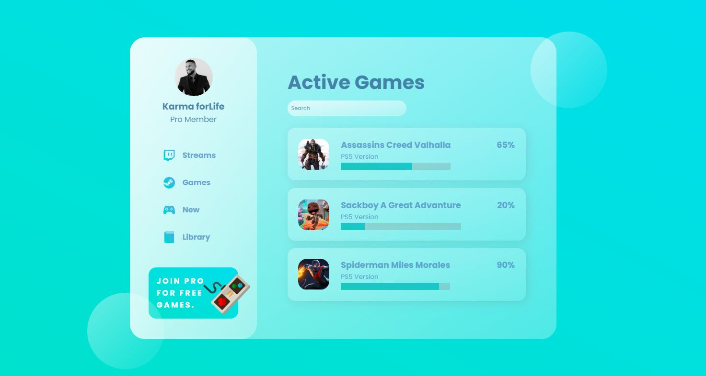

# Glass Effect Dashboard UI with React.js 

Download the code & run npm install to install dependencies before starting the app.

### npm install
### npm run dev

[See live app](https://glass-effect-dashboard.vercel.app/)